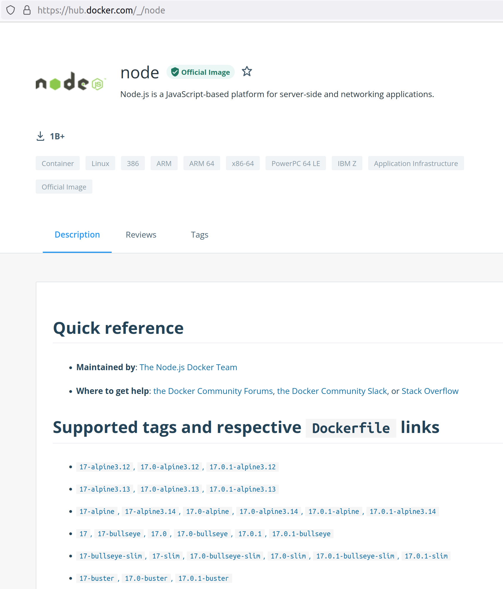

## Intro to Docker Compose

Docker Compose is the official tool for coordinating multiple Docker containers. However, its clean syntax and excellent developer experience also make it ideal for even single container apps. Docker Compose allows you to define multiple containers, each with their own Docker images, data, and commands, and then defines how they can interact with each other.

## Setup

At its most basic, all you need to run Docker Compose is a single file called `docker-compose.yml`. The only required part of a Docker Compose file is a top-level key called `services`, which is set to a collection. Each key in the collection is a label for the service and its value is a collection with the configuration details for that container.

```yaml
services: 
  frontend:
    # Configuration for frontend
  backend:
    # Configuration for backend
  database:
    # Configuration for database
```

To run Docker Compose, navigate to the folder containing `docker-compose.yml` and run `docker-compose up`. If the images for these containers haven't been built yet, you can do that automatically by adding the `--build` flag to the end of the command (`docker-compose up --build`). If the images have already been build, the `--build` tag doesn't do anything.

## Configuring Services

A service is a single container serving a single purpose. The most basic things to configure for a service are:

* [**`image`**](#image) - What image the service should use to build its container from
* [**`volumes`**](#volumes) - What data the container should use
* [**`ports`**](#ports) - What ports the service should use
* [**`command`**](#command) - What default command should be used to start the app

### Image

This specifies what image the service should use to build its container. If you don't need to customize the Dockerfile, you can use an official Docker Hub image or the name of an existing image on your computer using the `image:tag` format:

```yaml
services:
  backend:
    image: node:16-alpine3.11
```

Tags are a way of keeping versions of the same image. These usually represent different versions of the underlying software (such as versions of a language), but may also use different versions of the operating system or add and remove features. The Docker Hub page for an image contains a list of all of the different tags that are available, as well as the Dockerfiles they represent.



It's common to customize images for each app, but many useful containers can be built using unmodified official images from Docker Hub.

### Volumes

This specifies the locations of any code or other files the container should use.

```yaml
services:
  backend:
    volumes:
      - ./path/to/local/folder:/path/to/docker/folder
```

This keeps your code separate from the container while still allowing the container to read and write it. Volumes are effectively folders that exist in both the host and the container. Note that all files and data in the container that aren't in a volume will be discarded whenever the container is stopped.

### Ports

This specifies how to map the ports inside the container to ports outside the container.

```yaml
services:
  backend:
    ports:
      - "8000:80"
```

The example makes port 8000 on the host computer the same as port 80 inside the container. This is how you get things like web traffic into and out of containers.

### Command

This specifies the command that the container should run to start the app.

```yaml
services:
  backend:
    command: ["sh", "-c", "npm install && npm start"]
```

This is a default command that can be overridden on the CLI, and it takes an array of commands, options, and arguments. If you need to run more than one command, use the `["sh", "-c", "commands && go && here"]` format.

## Docker Compose Commands

These are the most common commands used in Docker Compose:

| Command | Purpose |
| --- | --- |
| `docker-compose up --build` | Start all of the services defined in the `docker-compose.yml` file. |
| `docker-compose down` | Stop all of the services for an app. |
| `docker-compose restart` | Restart all of the services for an app. |
| | |
| `docker-compose exec <name of service> <command>` | Run a command in a running container for one of the services. Use `/bin/bash` to get an interactive terminal. |
| `docker-compose run <name of service> <command>` | Same as `exec`, but is intended for one-off commands in temporary containers. Often used for scaffolding commands and tests. Use `/bin/bash` to get an interactive terminal. |
| | |
| `docker-compose ps` | List all of the containers for an app. |
| `docker-compose logs` | Start printing the output from all the services for an app. |

* These commands may need to be run as a superuser with `sudo`.
* After starting services with Docker Compose, you can stop them with `control` + `c` if the process is still active in your terminal.
* Interactive terminals can be useful for debugging, checking that volumes were mapped correctly, checking environment variables, etc.

## Watch Out!

* When mapping a local folder to a container folder, the local folder is always on the left and the container folder is on the right. Additionally, paths must either be relative (start with `.`) or absolute (start with `/`). Host paths should be relative and container paths should be absolute.
* Ordinarily, it's not important to wrap strings in YAML in quotes. With ports however, YAML may try to interpret a string in the `host_number:container_number` format as a base-60 number. Wrapping this in quotes avoids this.
* Commands in Docker can be issued in either shell form (`command: npm start`) or exec form (`command: ["npm", "start"]`). While it's more awkward to read, the exec form gets around several performance issues with Docker and should be preferred.
* Docker Containers are ephemeral, which means that all the data in them is destroyed when the container stops. The only way to persist data between containers is to store them in volumes.
* Docker Compose doesn't require you to pull images from Docker Hub before using them. Running `docker-compose` with the `--build` flag will pull, build, or reuse images as needed.
* `:latest` is a shortcut to the most recent tag of an image, but it should be avoided. The image it points to changes whenever a new one is published which takes away the predictability of containers.
* Mounting a volume on a folder in a container will overwrite any files that were already in that folder

## Additional Resources

| Resource | Description |
| --- | --- |
| [Docker Compose Overview](https://docs.docker.com/compose/) | Official docs for Docker Compose |
| [Docker Compose Reference](https://docs.docker.com/compose/compose-file/compose-file-v3/) | Reference for all available configuration values for Docker Compose files |
